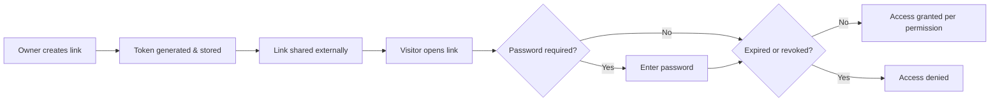
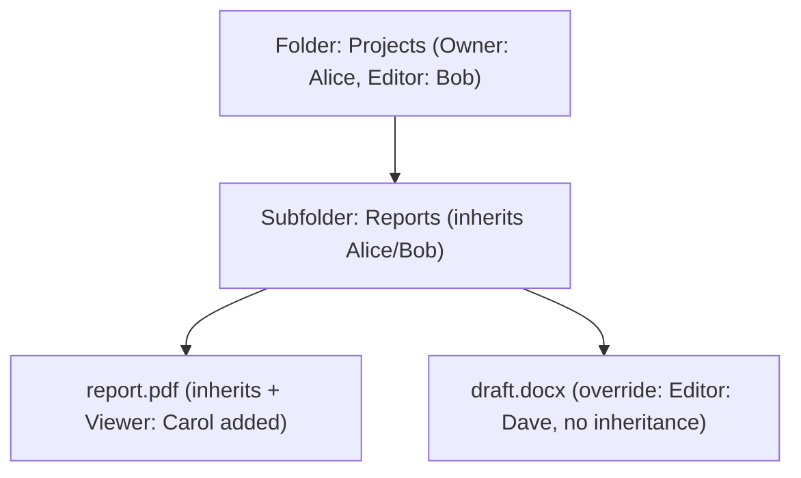
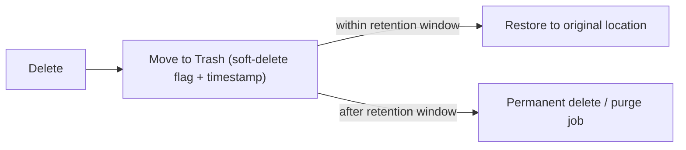

# File-Sharing System — Domain Analysis

*A product/domain deep-dive before implementation. No Spring Boot, no code — just what you're building and why.*

---

## 1. Understanding the Domain

### What a file-sharing system actually is
A file-sharing system is software whose core job is: **let a user store files, then controllably give other people access to those files** — without emailing attachments or handing over a USB drive. The controllable part is what makes it a *system* rather than a folder. Three things define it:

- **Storage** — durable place for the bytes
- **Access control** — who can see/edit/download what, and for how long
- **Distribution** — the mechanism (link, invite, permission grant) by which access reaches another person

### Problems it solves
- **Email attachment limits** (~25MB) and the "which version did I send" chaos of emailing files back and forth
- **Physical media friction** — no more USB drives, no more "resend please, it didn't attach"
- **Access without duplication** — one file, many people accessing the *same* copy, instead of five diverging copies
- **Controlled exposure** — share with exactly the people you intend, revoke when you no longer intend it
- **Asynchronous collaboration** — the file exists independent of both parties being online at once
- **Recovery from mistakes** — accidental deletion, overwritten edits, "I need last Tuesday's version"

### Types of file-sharing systems
| Type | Model | Examples |
|---|---|---|
| Cloud storage + sharing | Client-server, sync + share bundled | Google Drive, Dropbox, OneDrive |
| Enterprise content platforms | Compliance/governance-heavy sharing | Box, SharePoint |
| Ephemeral transfer services | Upload → link → auto-expire, no account needed | WeTransfer, Firefox Send (defunct), SwissTransfer |
| Self-hosted / open-source | You own the storage & server | Nextcloud, ownCloud, Seafile |
| Peer-to-peer | No central storage, direct transfer | BitTorrent, local AirDrop-style tools |
| Specialized/compliance-driven | Encryption & audit for regulated data | Legal data rooms, healthcare (HIPAA) file exchange |

### Typical real-world use cases
- Sending a large video/design file to a client who doesn't have an account anywhere
- A team collaboratively editing a shared folder of project documents
- A company distributing a read-only policy document to all employees, revocable later
- A photographer delivering a client gallery with a link that expires after 30 days
- Backing up files *and* being able to share a subset of them selectively
- Sharing sensitive documents (contracts, medical records) where access must be logged and provable

### How file sharing differs from adjacent categories
| Category | Primary job | File sharing overlap |
|---|---|---|
| **Cloud storage** | Durable, synced storage of *your* files across devices | Sharing is a *feature* cloud storage adds on top; file sharing is the storage's *reason to exist between people*, not just across your own devices |
| **Document management (DMS)** | Structured lifecycle for *documents* — approvals, retention policies, compliance, metadata-heavy taxonomies | DMS is about governing document *lifecycle*; file sharing is about *distributing access* to arbitrary files, docs included |
| **Temporary file-transfer (WeTransfer-style)** | One-shot, often accountless, auto-expiring delivery | No persistent ownership model, no folders, no long-term access control — just "get this file from A to B once" |

A pure file-sharing system sits at the intersection: it needs storage (like cloud storage), some governance (like a DMS, but lighter), and a strong sharing/link mechanism (like transfer services) — but its defining feature is **access control on persistent files**, which is exactly the part that maps well to what you already know (Spring Security).

---

## 2. Study of Existing Products

### What they provide, and why

| Product | What it optimizes for | Why |
|---|---|---|
| **Google Drive** | Deep integration with Docs/Sheets/Slides, ubiquitous granular sharing | Sharing needs to feel as easy as sharing a URL; Workspace users collaborate live inside files |
| **Dropbox** | Sync reliability, simplicity, "it just works" across OS/devices | Dropbox's original wedge was rock-solid file sync — sharing came after |
| **OneDrive** | Deep Windows/Office integration, enterprise identity (Entra ID/AD) | Sharing tied to organizational identity, not just email addresses |
| **Box** | Enterprise governance — compliance, retention, granular audit | Sold to IT departments and regulated industries, not consumers |
| **WeTransfer** | Zero-friction, no-signup delivery of large files, then forget about it | Solves the "I just need to send this once" case cloud storage over-engineers |
| **Nextcloud** | Self-hosted control — you own the server and the data | Solves the "I don't trust a third party with my data" case |

### Feature comparison

| Feature | Google Drive | Dropbox | OneDrive | Box | WeTransfer | Nextcloud |
|---|---|---|---|---|---|---|
| File/folder management | ✅ Full | ✅ Full | ✅ Full | ✅ Full | ❌ (flat, one-shot) | ✅ Full |
| User-to-user sharing | ✅ | ✅ | ✅ | ✅ | ❌ | ✅ |
| Public links | ✅ | ✅ | ✅ | ✅ | ✅ (core feature) | ✅ |
| Granular permissions (view/comment/edit) | ✅ Rich | ✅ | ✅ | ✅ Rich (enterprise roles) | ❌ | ✅ |
| Expiring links | ✅ | ✅ (paid) | ✅ | ✅ | ✅ (built-in, always) | ✅ |
| Password-protected links | ✅ | ✅ (paid) | ✅ | ✅ | ✅ (paid tier) | ✅ |
| Download controls (disable download) | ✅ | Limited | ✅ | ✅ | ❌ | ✅ |
| File versioning | ✅ | ✅ | ✅ | ✅ | ❌ | ✅ |
| Trash/recovery | ✅ | ✅ | ✅ | ✅ | N/A | ✅ |
| Search | ✅ Strong (incl. content) | ✅ | ✅ | ✅ | N/A | ✅ Basic |
| File previews | ✅ Many formats | ✅ | ✅ | ✅ | ❌ | ✅ |
| Activity/audit history | ✅ Basic (consumer) / Rich (Workspace) | Basic | Basic/Rich (enterprise) | ✅ Rich (core selling point) | ❌ | ✅ (app-dependent) |
| Storage quotas | ✅ | ✅ | ✅ | ✅ | N/A (per-transfer size cap instead) | ✅ (admin-set) |
| Security/privacy (encryption at rest/in transit, 2FA) | ✅ | ✅ | ✅ | ✅✅ (compliance certs) | ✅ (transit) | ✅ (you control it) |

### Common industry features vs. advanced/product-specific
**Table-stakes (every serious product has these):**
Upload/download, folders, ownership, basic sharing (view/edit), public links, search, trash with recovery window, storage quotas, encryption in transit.

**Advanced or product-specific (differentiators):**
- Real-time co-editing (Google Docs-style) — huge engineering lift, not expected in a portfolio project
- Enterprise audit trails with compliance certs (Box) — org-scale governance
- Download-disabled "view only" links — meaningful access-control nuance
- Selective sync / smart sync — client-side engineering, not server-domain
- Content-aware search (OCR, image recognition) — ML-adjacent, out of scope
- Ransomware detection / anomaly-based account protection — advanced security engineering

Knowing this distinction matters for you: your project should nail the **table-stakes list convincingly** and pick **one or two advanced items** (e.g., expiring + password-protected links, audit logging) to go deep on, rather than shallowly touching everything.

---

## 3. How a Real System Works (Conceptual Lifecycle)

| Stage | What happens | Key product decisions |
|---|---|---|
| **Upload** | Bytes travel from client to server/storage | Chunked vs. single-shot? Max size? Allowed types? Virus scan before or after storage? |
| **Storage** | Bytes are persisted somewhere durable | Local disk vs. object storage (see §5) — affects scalability and cost |
| **Metadata** | A database row is created describing the file | What's essential (owner, size, checksum) vs. nice-to-have (tags)? |
| **Ownership** | The uploader becomes the owner | Can ownership transfer? What happens to shares if the owner deletes their account? |
| **Sharing** | Owner grants access to others | Direct user grant vs. link-based — different trust models (see below) |
| **Access** | A grantee (or link visitor) tries to open the file | Every access must re-check permission validity, not just at share-time |
| **Download** | The actual bytes are served | Direct stream, or should it go through the app to enforce checks/log the event? |
| **Activity** | The action is recorded | Who accessed what, when — needed for audit and for "who viewed this" UX |
| **Revocation/Deletion** | Access or the file itself is removed | Soft-delete first (trash) almost always beats hard-delete for safety |

### User-to-user sharing
The owner picks a specific user (by email/username) and grants a role (viewer/editor). This is an **explicit trust relationship** — the system knows exactly who has access, so it's the safest sharing mode and the easiest to revoke individually.

### Public/shareable links
A random, unguessable token is generated and tied to the file/folder + a permission level. Anyone holding the URL can access it — the system trades "I know exactly who has access" for "convenience of not requiring the recipient to have an account." This is why link security properties (randomness, expiry, password) matter so much — see §4.

### How permissions work
Almost every system settles on a small role set: **Owner > Editor > Commenter > Viewer** (naming varies). The owner has implicit full control; every other role is a bounded subset. The important design idea: **permission checks happen at access-time, not just grant-time** — a revoked or expired grant must fail on the very next request, not just stop appearing in a UI list.

### Folders and inherited permissions
Sharing a folder implicitly shares everything inside it — this is *inheritance*. The product question is: can a file inside inherit a *broader* permission than an explicit override says? Most systems resolve this as "most specific permission wins," but they must also decide whether a sub-item can be shared *more narrowly or more widely* than its parent.

### How access is revoked or expires
- **Manual revocation** — owner removes a user or deletes a link; must take effect immediately, not on next login
- **Time-based expiry** — link/grant carries an expiry timestamp checked on every access
- **Cascading revocation** — revoking access to a parent folder must revoke derived access to its contents (unless an explicit override exists)

### Deleted files and restoration
Almost universally: **delete = soft-delete into a Trash state**, not immediate physical removal. This protects against user error (the #1 real-world cause of "lost" files) and gives a recovery window before a background job permanently purges old trash.

### Why file versioning exists
People overwrite files by mistake, want to compare drafts, or need to roll back after a bad edit. Versioning turns "I accidentally saved over the good version" from a disaster into a two-click recovery. It also solves collaboration conflicts: instead of silently overwriting someone else's edit, the system can keep both as versions.

---

## 4. Security and Reliability

| Problem | What it means | How mature systems address it conceptually |
|---|---|---|
| **Unauthorized access** | Someone reaches a file they shouldn't | Every access checks current permission state server-side — never trust a client-side "I have access" assumption |
| **Broken access control / IDOR** | Guessing/incrementing an ID (`/files/1042`) reaches another user's file | Never expose sequential internal IDs in shareable contexts; always re-verify ownership/grant on the server for every request, not just at the UI layer |
| **Guessable sharing links** | Predictable tokens (`/share/1`, `/share/2`) let attackers enumerate files | Use cryptographically random, high-entropy tokens (not sequential IDs, not short codes) |
| **Leaked sharing tokens** | A link posted publicly by accident, forwarded beyond intent | Support revocation, expiry, and optionally password-gating so a leaked link isn't permanent unconditional access |
| **Malicious files** | Uploaded files could contain malware, or be disguised (double extensions, wrong MIME type) | Validate declared content-type against actual content, restrict/scan file types, never execute uploaded content, serve downloads with safe headers |
| **File-size/storage abuse** | A user fills storage with junk or a single attacker exhausts capacity | Per-user quotas, per-file size limits, enforced before/during upload not just after |
| **Public-link abuse** | A link is scraped, hotlinked, or hammered by bots | Rate limiting on public endpoints, optional CAPTCHA on link access, download-count/view-count caps |
| **Account compromise** | An attacker gets a user's credentials and now has all their shares | Strong password hashing, optional 2FA, session invalidation on password change, activity visibility so the real user notices anomalies |
| **Rate limiting** | Any endpoint (login, upload, link access) can be hammered | Throttle by IP/user/token, especially on unauthenticated/public paths |
| **Storage quotas** | Ties into abuse prevention and fair-use, also a real cost-control mechanism | Track usage per user, enforce before accepting new uploads, surface remaining quota to the user |
| **Audit logging** | "Who did what, when" — needed for trust, debugging, and compliance | Append-only log of access/share/delete/download events, separate from mutable application data |

The unifying theme across all of these: **the server must be the source of truth for every permission check, on every request** — this is the single most important lesson a file-sharing system teaches, and it's exactly where Spring Security (which you're currently learning) does real work rather than boilerplate.

---

## 5. Storage and File Metadata

### Where the bytes live

| Approach | How it works | Pros | Cons | When it's used |
|---|---|---|---|---|
| **Local filesystem** | Files saved directly to disk on the app server | Simple, no external dependency | Doesn't scale horizontally (files tied to one server), backup/redundancy is manual, risky in production | Small self-hosted setups, early prototypes |
| **Database BLOB** | File bytes stored as a column in the DB | Transactional consistency with metadata, single backup story | Bloats the database, terrible for large files, hurts DB performance/backup speed | Rare; only for small files (icons, thumbnails) alongside a "real" storage strategy |
| **Object storage** (S3, MinIO, Azure Blob, GCS) | Files stored as objects in a dedicated storage service, addressed by key; app DB stores only metadata + a reference | Scales independently of the app, built-in redundancy, cheap at scale, supports pre-signed URLs for direct client upload/download | Extra moving part to run/configure, eventual consistency nuances | Virtually all production file-sharing systems today |

**Why modern systems use object storage:** the app server should never be a bottleneck or single point of failure for gigabytes of file bytes. Object storage decouples "serving file bytes" from "running your business logic," scales storage independently, and — critically for a portfolio project — is the **realistic, industry-standard choice**, which is exactly the kind of decision that shows up well in an interview ("why not just save to disk?").

For a solo project, **MinIO** (S3-compatible, self-hostable, free) is the practical choice: it lets you write real object-storage code without an AWS bill.

### What metadata to maintain, and why

| Field | Why it matters |
|---|---|
| Filename (display name, distinct from storage key) | Users rename files; the storage key shouldn't have to change when they do |
| Size | Quota enforcement, UI display, upload validation |
| Content type (MIME) | Preview rendering, download headers, validating against actual bytes |
| Owner (user reference) | Access control root — everything else is a grant relative to this |
| Timestamps (created, modified, deleted) | Sorting, trash retention windows, audit trails |
| Checksum/hash (e.g., SHA-256) | Detect corruption, detect duplicate uploads, verify integrity after storage/retrieval |
| Version number / version history reference | Enables versioning and rollback |
| Folder/parent reference | Defines the hierarchy and permission inheritance path |
| Storage key/path (internal, not user-facing) | The actual pointer into object storage — decoupled from the display filename |
| Status (active/trashed/deleted) | Drives soft-delete and restore logic |

---

## 6. What Should Your Project Contain?

One honest note before the tiers: this is a domain where **"clone of a major product"** is an easy trap — and you've said you specifically want to avoid that. The differentiator isn't a novel storage engine; it's an **angle**. A few real ones that keep this from being "my Google Drive clone":
- **Time-boxed secure sharing** for a specific real scenario (e.g., sharing sensitive documents with expiring, watermark-free, download-capped, password-gated links) — leans hard into §4
- **Team/workspace-scoped sharing** (a lightweight Box-for-small-teams angle) with folder-level roles and audit trails — leans into permission inheritance
- **Client-delivery focused** (photographer/freelancer delivering final files to clients) — leans into public links, expiry, and download controls, and skips deep folder hierarchies

Pick a lens; it changes which features in the matrix below are "core" vs. "extra" for *your* version, without changing the underlying system.

### MVP — essential functionality
| Feature | Problem it solves |
|---|---|
| Register/login (Spring Security) | Baseline identity — everything else needs "whose file is this" |
| Upload/download files | The core value proposition |
| Folder structure | Files need organization beyond a flat list |
| Ownership | Establishes the root of every permission decision |
| User-to-user sharing (view/edit roles) | The actual "sharing" in file-sharing |
| Public shareable links | The most common real-world sharing mode |
| Basic permission enforcement | Without this it's just a file host, not a sharing *system* |
| Trash + restore (soft delete) | Prevents the most common real-world disaster (accidental deletion) |
| Storage quotas | Prevents unbounded abuse, teaches enforcement-before-accept logic |

### Portfolio Version — features that make it genuinely impressive
| Feature | Value it adds |
|---|---|
| Expiring links | Real product feature, teaches time-based access checks |
| Password-protected links | Meaningful security depth beyond CRUD |
| Download-disabled ("view only") links | Shows nuanced permission modeling, not just binary access |
| File versioning | Non-trivial data modeling + a real recovery story |
| Activity/audit log | Demonstrates you understand traceability, not just happy-path CRUD |
| Object storage integration (MinIO/S3) | The single highest-signal architectural decision in this whole project |
| Search (filename + metadata filters) | Realistic usability feature, moderate complexity |
| File previews (basic types: images, PDFs) | Noticeable UX payoff for contained effort |
| Rate limiting on public/unauthenticated endpoints | Directly addresses a named threat from §4 |

### Advanced Version — deeper system-design/engineering signal
| Feature | What it demonstrates |
|---|---|
| Pre-signed URLs for direct client ↔ object-storage upload/download | Real scalability pattern — app server never touches file bytes |
| Chunked/resumable large-file uploads | Handling failure and partial-progress, not just the happy path |
| Async virus/malware scanning pipeline (queue-based) | Decoupling slow/unsafe work from the request cycle |
| Background purge job for trashed files (scheduled task) | Real operational concern, not just a feature |
| Folder-level permission inheritance with override resolution | The hardest *correctness* problem in the whole domain |
| Redis-backed caching for permission checks / rate limiting | Ties directly into your stated "learn Redis" goal, with a genuine use case |
| Checksum-based deduplication | Storage efficiency at a systems level |

**What not to add just because it sounds impressive:** real-time co-editing (Docs-style), content-aware/ML search, microservices split, Kubernetes. None of these solve a problem your MVP+Portfolio+Advanced tiers don't already cover convincingly, and all of them contradict your own stated "no unnecessary complexity" preference.

---

## 7. Resume/GitHub Value

| Level | What defines it |
|---|---|
| **1. Basic student CRUD project** | Upload/download + a file list. No real permission model, no revocation, files stored directly on disk, no versioning or trash. Looks like a tutorial follow-along. |
| **2. Decent backend project** | Adds real auth, folders, and basic sharing. Functionally complete but doesn't demonstrate *why* any decision was made — permissions are just a boolean flag, storage is still local disk. |
| **3. Strong GitHub/resume project** | Object storage (not local disk), enforced permissions checked server-side on every access, expiring/password links, soft-delete + restore, versioning, and an audit log. This is where the project stops looking like a tutorial and starts looking like a product. |
| **4. Project worth discussing in a backend interview** | Everything in tier 3, *plus* you can articulate trade-offs: why object storage over local/BLOB, how you prevent IDOR, how permission inheritance resolves conflicts, why soft-delete exists, what happens under a leaked-link scenario, and one deliberately-cut scope decision (and why). Interviewers care less about feature count and more about whether you can defend the decisions. |

### Highest-priority features and decisions to prioritize
If you only have time for a subset, prioritize in this order — each one is disproportionately high-signal relative to its effort:
1. **Object storage over local disk** — single biggest "this person thinks about production" signal
2. **Server-side permission enforcement on every access** (not just at share-time) — this *is* the domain
3. **Expiring + password-protected public links** — cheap to build, very real, directly addresses a named security concern
4. **Soft-delete/trash + restore** — small effort, large "thoughtful product design" signal
5. **Audit/activity log** — differentiates you from every basic CRUD clone
6. **File versioning** — genuinely hard data modeling, strong interview talking point

---

## 8. Final Feature Priority Matrix

| Feature | Priority | Phase | User Value | Resume Value | Complexity | Why It Matters |
|---|---|---|---|---|---|---|
| Register/login (Spring Security) | Must-have | MVP | High | Med | Low | Identity is the root of every permission decision |
| File upload/download | Must-have | MVP | High | Low | Low | Core value proposition |
| Folder structure | Must-have | MVP | High | Low | Med | Files need organization; sets up inheritance later |
| Ownership model | Must-have | MVP | High | Med | Low | Root of the access-control model |
| User-to-user sharing (roles) | Must-have | MVP | High | Med | Med | The actual "sharing" in file-sharing |
| Public shareable links | Must-have | MVP | High | Med | Med | Most common real-world sharing mode |
| Server-side permission enforcement | Must-have | MVP | High | High | Med | Prevents IDOR/broken access control — the core domain lesson |
| Storage quotas | High | MVP | Med | Med | Low | Prevents abuse, realistic constraint |
| Trash / soft-delete + restore | High | MVP | High | Med | Low | Prevents the most common real disaster; cheap to build |
| Object storage (MinIO/S3) | Must-have | Portfolio | Med | High | Med | Single highest architecture signal in the whole project |
| Expiring links | High | Portfolio | High | High | Low | Real feature, addresses leaked-link risk directly |
| Password-protected links | High | Portfolio | High | High | Low | Meaningful security depth, low effort |
| Download-disabled links | Medium | Portfolio | Med | Med | Low | Nuanced permission modeling beyond binary access |
| File versioning | High | Portfolio | High | High | Med | Non-trivial modeling, strong recovery story |
| Activity/audit log | High | Portfolio | Med | High | Med | Traceability signal; differentiates from basic CRUD |
| Search (filename/metadata) | Medium | Portfolio | Med | Med | Med | Realistic usability, moderate effort |
| File previews (images/PDF) | Medium | Portfolio | Med | Med | Med | Visible UX payoff |
| Rate limiting (public endpoints) | Medium | Portfolio | Med | High | Low | Directly addresses a named security threat |
| Pre-signed direct upload/download URLs | Medium | Advanced | Low | High | High | Real scalability pattern; app server stops touching bytes |
| Chunked/resumable uploads | Low | Advanced | Med | High | High | Handles partial-failure, large-file realism |
| Async malware-scan pipeline | Low | Advanced | Low | High | High | Decoupling unsafe work from the request cycle |
| Scheduled trash-purge job | Medium | Advanced | Low | Med | Low | Real operational concern, easy to add once trash exists |
| Folder permission inheritance w/ overrides | Medium | Advanced | Med | High | High | Hardest correctness problem in the domain |
| Redis-backed permission cache / rate limiting | Low | Advanced | Low | High | Med | Ties to your own stated Redis learning goal with a real use case |
| Checksum-based deduplication | Low | Advanced | Low | Med | Med | Storage efficiency at a systems level |
| Real-time co-editing | Not recommended | — | — | — | Very High | Massive effort, doesn't fit a solo portfolio timeline |
| Content-aware/ML search | Not recommended | — | — | — | Very High | Out of scope, doesn't teach backend/domain fundamentals |

### Recommended final feature set for a solo developer
The smallest set that still feels like a credible, production-inspired system — not a tutorial project:

1. Spring Security auth (register/login)
2. Folders + ownership + object storage (MinIO) for actual file bytes
3. User-to-user sharing with roles (viewer/editor), enforced server-side on every request
4. Public links with **expiry + password protection** (skip download-disable at first, add if time allows)
5. Soft-delete/trash with restore
6. Basic file versioning (keep prior versions on overwrite, list + restore a version)
7. Activity/audit log (upload, share, download, delete events)
8. Storage quotas + basic rate limiting on public link access

That's roughly the MVP tier plus five specific Portfolio items — enough to defend every one of §4's security concerns in an interview, without reaching for advanced-tier infrastructure (queues, pre-signed URLs, dedup) that would meaningfully extend the timeline without proportional resume value. Those Advanced-tier items are a good "if I have time left over" list, not a starting scope.
